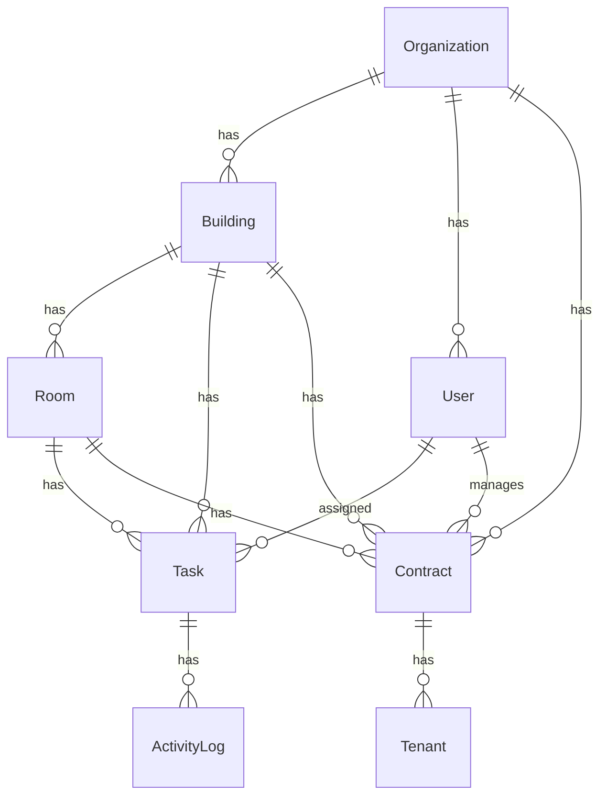

# 🏠 Smile Home — Field Operations Control System

<p align="center">
  <b>Hệ thống quản lý vận hành nhà trọ thông minh dành cho chủ nhà & quản lý hiện trường</b>
</p>

---

## 🎯 Ý tưởng

**Smile Home** ra đời từ bài toán thực tế: quản lý vận hành hàng chục phòng trọ rải rác ở nhiều tòa nhà là một **cơn ác mộng** nếu chỉ dựa vào Zalo, sổ tay và trí nhớ.

Chủ nhà/quản lý phải xử lý hàng loạt công việc mỗi ngày:
- 🔑 **Dẫn khách xem phòng** — cần biết phòng nào đang trống, ở tòa nào, tầng nào.
- 📋 **Ký hợp đồng, nhận cọc** — theo dõi trạng thái từ tư vấn → cọc → ký → vào ở → kết thúc.
- 🔧 **Sửa chữa, bảo trì** — dispatch kỹ thuật viên, chụp ảnh trước/sau khi sửa.
- 💰 **Thu tiền, đối soát** — biết phòng nào đã đóng, phòng nào nợ tiền.
- 🚶 **Di chuyển giữa các tòa nhà** — tối ưu tuyến đường để không chạy lòng vòng.

**Smile Home** giải quyết tất cả bằng một hệ thống duy nhất, thiết kế cho **thao tác một tay trên điện thoại** khi đang ở hiện trường.

---

## ✨ Tính năng chính

### 📍 Smart Daily Route — Tuyến đường thông minh
Danh sách công việc trong ngày được **tự động nhóm theo tòa nhà**, sắp xếp theo **tầng từ thấp đến cao**, ưu tiên **việc gấp lên đầu**. Quản lý chỉ cần mở app lên và đi theo danh sách — không cần suy nghĩ.

### 📝 Task Engine — Quản lý công việc
Hỗ trợ nhiều loại task chuyên biệt:
| Loại task | Mô tả |
|-----------|--------|
| `SHOW_ROOM` | Dẫn khách xem phòng |
| `MOVE_IN` / `MOVE_OUT` | Nhận/trả phòng |
| `MAINTENANCE_CHECK` | Kiểm tra sửa chữa |
| `MAINTENANCE_SUPERVISION` | Giám sát kỹ thuật viên |
| `PAYMENT_COLLECTION` | Thu tiền phòng |
| `ROOM_INSPECTION` | Kiểm tra phòng định kỳ |
| `FOLLOW_UP` | Theo dõi khách / vấn đề |

### 📸 Photo-First Execution — Chụp ảnh là bắt buộc
Mỗi task bảo trì đều yêu cầu chụp **ảnh trước và sau** khi thực hiện. Đây là bằng chứng minh bạch cho chủ nhà, khách thuê và kế toán.

### 📄 Hợp đồng & Khách thuê
Quản lý toàn bộ vòng đời hợp đồng:
```
Tư vấn → Yêu cầu cọc → Đã cọc → Ký hợp đồng → Đang thuê → Kết thúc
```
- Lưu thông tin khách thuê (tên, SĐT, CMND/CCCD)
- Ghi nhận tiền cọc, giá thuê hàng tháng
- Chụp ảnh hợp đồng giấy gửi về kế toán

### 📊 Dashboard tổng quan
- Tổng số phòng trống / đang thuê / đang bảo trì
- Doanh thu tháng, công nợ, tỷ lệ lấp đầy
- Tình trạng task trong ngày

### 🔐 Phân quyền người dùng
- **Admin**: quản trị toàn hệ thống
- **Manager**: quản lý hiện trường, xử lý task
- **Technician**: kỹ thuật viên sửa chữa

---

## 🏗️ Kiến trúc hệ thống

```
smile-home-field-ops/
├── api/                    # Backend — NestJS
│   ├── src/
│   │   ├── auth/           # Đăng nhập, JWT
│   │   ├── buildings/      # Quản lý tòa nhà
│   │   ├── rooms/          # Quản lý phòng
│   │   ├── tasks/          # Task engine
│   │   ├── contracts/      # Hợp đồng
│   │   ├── dashboard/      # Dashboard API
│   │   └── prisma/         # Database service
│   └── prisma/
│       ├── schema.prisma   # Data model
│       └── seed.ts         # Sample data
│
└── web/                    # Frontend — Next.js 15
    ├── src/app/
    │   ├── page.tsx         # Dashboard
    │   ├── route/           # Smart Route
    │   ├── tasks/           # Task management
    │   ├── contracts/       # Hợp đồng
    │   └── api/             # API routes (Vercel deploy)
    └── prisma/
        └── schema.prisma    # Shared schema
```

---

## 🛠️ Tech Stack

| Layer | Công nghệ |
|-------|-----------|
| **Frontend** | Next.js 15, React, Tailwind CSS, Lucide Icons |
| **Backend** | NestJS, Prisma ORM |
| **Database** | PostgreSQL (production) / SQLite (dev) / Turso (cloud) |
| **Auth** | JWT-based authentication |
| **Deploy** | Vercel (frontend + API routes), PWA-ready |

---

## 🚀 Khởi chạy

### Backend (API)
```bash
cd api
npm install
# Tạo file .env với DATABASE_URL
npx prisma migrate dev
npm run seed
npm run start:dev          # → http://localhost:3000
```

### Frontend (Web)
```bash
cd web
npm install
npm run dev                # → http://localhost:3001
```

---

## 🗄️ Data Model



---

## 🎯 Tầm nhìn

Smile Home không chỉ là một app quản lý — mà là **hệ điều hành cho vận hành nhà trọ**:

1. **Phase 1** ✅ — Smart Route + Task Engine + Contract Management
2. **Phase 2** 🚧 — Chat-to-Expense: nhắn tin Zalo → tự động ghi nhận chi phí
3. **Phase 3** 📋 — Auto Billing: tự động tính tiền điện nước, phát hành hóa đơn
4. **Phase 4** 📊 — Analytics: báo cáo lợi nhuận, dự đoán dòng tiền, cảnh báo rủi ro

---

## 📝 License

MIT

---

<p align="center">
  Made with ❤️ for rental property managers in Vietnam
</p>
